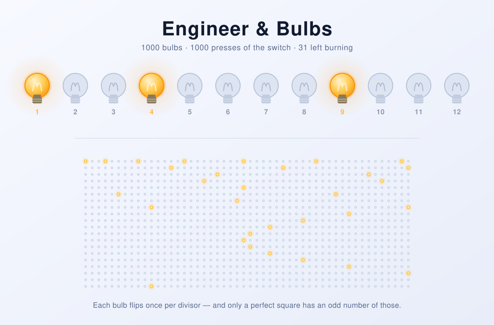

Engineer-and-bulbs
==================

A small puzzle, solved by simulation — and an excuse to look at the same
question from four different angles, from brute force down to a one-liner.

<picture>
  <source media="(prefers-color-scheme: dark)" srcset="docs/banner-dark.svg">
  
</picture>

*(The banner is not decoration: which bulbs glow in it was decided by running
the solver in this repository, so the picture is the answer.)*

## Problem definition

There are `1 000` light bulbs numerated from `1` to `1 000`.
An engineer created a switching mechanism, which switches a state of a single
light bulb (from *turned off* to *turned on* and vice versa) in a peculiar way.
If the switch was pressed **K** times, the state of all light bulbs which index is
divided by **K** changes.

At the beginning, all light bulbs are turned off.

Experiment starts:

After first switch (which is `K = 1`) all light bulbs are turned on.
After second switch (which is `K = 2`) even light bulbs are turned off, and odd light bulbs stay turned on.
After third switch (`K = 3`) all bulbs, which numbers are odd and divisible by `3` and all
bulbs, which numbers are even and divisible by `3`, are turned on. Rest of the light bulbs are turned off.

Find which bulbs are switched on at the end of experiment.

## Requirements

**Python 3.10 or newer** — tested up to 3.13, and nothing here is expected to
break on later versions. No third-party packages, no build step, nothing to
install.

Older interpreters are not supported. On Python 3.9 and below the script fails
at import with a `TypeError`, because it writes optional parameters as
`list[str] | None` — the `X | Y` union syntax
([PEP 604](https://peps.python.org/pep-0604/)) only became valid at runtime in
3.10. Python 2 is long gone from this repo; the original version supported it
via `six`.

Check what you have with `python --version`, and mind that on many systems
`python` and `python3` point at different interpreters.

## Computational solution

```
python bulbs_game.py
```

Options:

| Flag | Meaning |
| --- | --- |
| `-n N`, `--count N` | Solve for `N` bulbs instead of the default `1000`. |
| `-v`, `--verbose` | Print every individual flip on stderr while simulating. |
| `-h`, `--help` | Show usage. |

The list of lit bulbs goes to **stdout**, the summary line and the verbose trace
go to **stderr**, so the result stays easy to pipe somewhere else:

```
$ python bulbs_game.py -n 100 2>/dev/null
{1, 4, 9, 16, 25, 36, 49, 64, 81, 100}
```

Following the mechanism by hand on a small board:

```
$ python bulbs_game.py -n 6 -v
press    1: bulb    1 divisible by    1 -> switched on
press    1: bulb    2 divisible by    1 -> switched on
...
press    6: bulb    6 divisible by    6 -> switched off
{1, 4}
```

## The answer, and why

The bulbs left burning are exactly the **perfect squares**: `1, 4, 9, 16, …`.
For `1 000` bulbs that is `31` of them, the last one being `961 = 31²`.

Bulb `n` is flipped once for every `K` that divides it, so its final state is
decided by the *parity of its divisor count*: odd number of divisors → lit,
even → dark. And divisors come in pairs — for every divisor `d` of `n` there is
a matching partner `n / d`. Bulb `36`, for instance, pairs `1·36`, `2·18`,
`3·12`, `4·9`, and then `6·6`. That last pair is the interesting one: it is the
only case where a divisor is its own partner, and it happens exactly when
`n = d²`. Every non-square therefore has divisors in tidy couples (even count,
ends dark), and every square has one lonely divisor left over (odd count, ends
lit).

Which also answers "how many bulbs are lit?" without listing them at all:
`floor(sqrt(N))`.

## Other ways to solve it

The simulation in this repository is the most literal reading of the puzzle, not
the best one. Four approaches, from most to least work:

**1. Naive simulation — `O(N²)`.**
For each press `K`, walk over *every* bulb and test `bulb % K == 0`. This is
what the first version of this repo did: a million divisibility tests for a
thousand bulbs. Simple to write, and it scales badly the moment `N` grows.

**2. Multiples-only simulation — `O(N log N)`.** *(what `bulbs_game.py` does now)*
For each press `K`, jump straight to `K, 2K, 3K, …` instead of asking every bulb
whether it qualifies. Same answer, but the work drops to `N/1 + N/2 + N/3 + …`,
which is about `N · ln N` — roughly 7 500 flips instead of a million. The trick
is the same one that makes the Sieve of Eratosthenes fast.

**3. Count divisors per bulb — `O(N√N)`.**
Skip the simulation entirely and ask the real question directly: does bulb `n`
have an odd number of divisors? Trial-divide up to `√n`, counting `d` and `n/d`
as a pair:

```python
from math import isqrt

def divisor_count(n: int) -> int:
    total = 0
    for d in range(1, isqrt(n) + 1):
        if n % d == 0:
            total += 2 if d != n // d else 1
    return total

lit = [n for n in range(1, 1001) if divisor_count(n) % 2 == 1]
```

Slower than the sieve for the whole board, but it can answer for a *single*
bulb — "is bulb 8 675 309 lit?" — without touching the other ones.

**4. Closed form — `O(√N)`, or `O(1)` if you only want the count.**
Once you know the answer is "the perfect squares", there is nothing left to
compute:

```python
from math import isqrt

lit = [k * k for k in range(1, isqrt(1000) + 1)]   # the bulbs themselves
how_many = isqrt(1000)                             # just the count
```

This is the honest solution to the puzzle. Generating the answer costs one
multiplication per lit bulb, and the count is a single square root — for a
billion bulbs it is still instant, while approach 2 would be grinding through
tens of billions of flips.

The simulation earns its place anyway: it is the version that needs no insight,
and it is what you would use to *check* the clever answer. Run
`python bulbs_game.py -n 500` and compare it against `[k*k for k in range(1, 23)]`
— agreement between a dumb method and a smart one is decent evidence that the
smart one is right.

### If you did want the simulation to go faster

Vectorising the flips with `numpy` keeps the brute-force spirit while removing
the Python-level loop, which matters for large `N`:

```python
import numpy as np

def simulate(n: int) -> np.ndarray:
    states = np.zeros(n + 1, dtype=bool)
    for press in range(1, n + 1):
        states[press::press] ^= True     # flip every multiple in one go
    return states
```

Same `O(N log N)` work, but performed in compiled code. It is a dependency
this repo does not need for `N = 1000`, and a sensible one for `N = 10⁸`.

## History

Originally written years ago as a quick Python 2/3 prototype (it used `six` and
printed two lines of trace per flip). The 2026 refresh dropped the dependency,
switched to the multiples-only sieve, added type hints, docstrings and a small
CLI, fixed an off-by-one that quietly left bulb `1000` out of the experiment,
and wrote down the mathematics above.

## Literature

This puzzle is not original to this repository — it is a well-travelled classic
that most sources call **the locker problem**. The usual framing swaps bulbs for
a school corridor: `n` lockers, all closed, and `n` students, where student `k`
toggles every `k`-th locker. Same rule, same answer, and the count of survivors
is `floor(sqrt(n))` either way. It also circulates as **"100 doors"** and, in
the exact wording used here, as the **bulb switcher**.

**In mathematics education.** The problem is a staple for introducing factors,
multiples and divisor counting, and it has been written up repeatedly as a
classroom activity — Kimani, Olanoff and Masingila's
["The Locker Problem: An Open and Shut Case"](https://pubs.nctm.org/view/journals/mtms/22/3/article-p144.pdf)
in NCTM's *Mathematics Teaching in the Middle School* 22(3) (2016), and
Seshaiyer, Suh and Freeman's
["Unlocking the Locker Problem"](https://math.gmu.edu/~pseshaiy/publications/nctm_locker_2011.pdf)
in *Teaching Children Mathematics*, are two representative treatments. The
appeal for teaching is that the brute-force answer is reachable by any student
with squared paper, while the *reason* for it is a genuine piece of number
theory.

**In the research literature.** The base case is folklore, but its
generalizations are not:

- B. Torrence and S. Wagon, *The Locker Problem*, **Crux Mathematicorum** 33(4)
  (May 2007), 232–236 — the standard mathematical write-up, listed among
  [Wagon's papers](https://stanleywagon.com/books-papers/). Torrence also has
  *Extending the Locker Problem* in *Mathematica in Education and Research*
  11(1) (2006).
- R. L. Jayne and R. T. Koether,
  [*Iterating the Locker Problem*](https://www.tandfonline.com/doi/abs/10.1080/0025570X.2020.1736887),
  **Mathematics Magazine** 93(3) (2020), 213–224 — replaces the two-state door
  with `q` states for prime `q`, so a locker cycles `0, 1, …, q-1` instead of
  merely flipping. The two-state puzzle here is the case `q = 2`.
- K. A. P. Dagal, [*The Generalized Locker Problem*](https://arxiv.org/abs/1307.6455),
  arXiv:1307.6455 (2013) — lets the number of students differ from the number of
  lockers and lets arbitrary subsets of students participate, then shows those
  subsets form an abelian group isomorphic to the power set under symmetric
  difference, with a bijection onto the reachable locker states.

**In programming culture.** The puzzle is a fixture of language comparisons and
interview prep. [Rosetta Code's *100 doors*](https://rosettacode.org/wiki/100_doors)
carries implementations in hundreds of languages, and explicitly asks for the
honest simulation rather than the perfect-squares shortcut, since the point
there is to compare language syntax rather than cleverness. As
[LeetCode 319, *Bulb Switcher*](https://leetcode.com/problems/bulb-switcher/),
it is graded on the opposite instinct: the accepted answer is
`return isqrt(n)`, and simulating is how you time out. This repository happily
does the disallowed thing in both directions — it simulates, and it tells you
the shortcut.

**The underlying fact.** That a number has an odd divisor count exactly when it
is a perfect square is a standard result about the divisor function `d(n)` (also
written `τ(n)`), found in any introductory number theory text. The two relevant
sequences are [OEIS A000005](https://oeis.org/A000005) (number of divisors of
`n`) and [OEIS A000290](https://oeis.org/A000290) (the squares themselves — the
bulbs left burning).

**A word of warning on the name.** Searching for "the locker puzzle" will mostly
return a *different* problem: the one where 100 prisoners each open 50 of 100
drawers hunting for their own number, and a cycle-following strategy beats the
naive `2^-100` odds up to about 31%. That is the subject of Curtin and
Warshauer's *The Locker Puzzle* (*The Mathematical Intelligencer* 28, 2006,
28–31) and of the [100 prisoners problem](https://en.wikipedia.org/wiki/100_prisoners_problem).
Despite the near-identical name, it has nothing to do with toggling, divisors,
or this repository.

## License

Released into the public domain (the Unlicense) — see [LICENSE](LICENSE).
